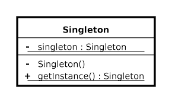

# Singleton (en-us)
### **Description**

> Ensuring that a class has only one instance by providing a global access point to that instance
---
Look at the UML Diagram below:

* The Singleton class declares a static member **instance()** using the single instance of the class to handle the reference.
* Private contructor without parameter, ensuring that no one can instantiate the class, only the class itself.
* Private and static member (property) of the same type as the class (**Instance**)
* Chech if **Instance** field exists, otherwise instantiate itself for the first and only time.



---
### **Implementação**
Look at the class below:
* Private, static, read-only member using the **Lazy<T>** class implementation that provides lazy initialization with multithreaded access.
Ensuring that in a multithreaded environment, any thread will have access to te same instance of the **Singleton**.

```cs
 public class Singleton
{
    private static readonly Lazy<Singleton> _lazySingleton = new Lazy<Singleton>((() => new Singleton()));
    
    private Singleton()
    {

    }

    public static Singleton Instance
    {
        get { return _lazySingleton.Value; }
    }
}
```
---

### **Testing Implementation**
Criamos duas instâncias de **Singleton** e comparamos se elas são iguais, garantindo assim o princípio de **"que uma classe tenha somente uma instância"**.
```cs
static void Main(string[] args)
{
    Singleton singleton1 = Singleton.Instance;
    Singleton singleton2 = Singleton.Instance;

    if(singleton1 == singleton2)
        Console.WriteLine("Equals");
    else
        Console.WriteLine("Differents");
}
```
O Resultado no console: 
```
Instance:1
Equals
```

### **Testando em ambiente multi thread**
Criamos dois métodos (**Thread1() e Thread2()**), cada método criando uma instância da classe **Singleton**. Observe que passamos a usar a classe **Parallel** para simulhar uma ambiente multi thread. Ela garante a chamada aos dois métodos de forma paralela.

```cs
static void Main(string[] args)
{
    Parallel.Invoke(
        () => Thread1(),
        () => Thread2()
    );
}

private static void Thread1()
{
    Singleton singleton1 = Singleton.Instance;
    Console.WriteLine("Thread 1");
}
private static void Thread2()
{
    Singleton singleton2 = Singleton.Instance;
    Console.WriteLine("Thread 2");
}
```
O Resultado no console:
```
Instance:1
Thread 2
Thread 1
```

<br><br>
---
# Singleton (pt-br)
### **Descrição**

> Garantir que uma classe tenha somente uma instância fornecendo um ponto de acesso global a essa instância

---
Observe o Diagrama UML abaixo:

* A classe Singleton declara um membro estático **instance()** usando para tratar a referência a única instância da classe.
* Construtor privado e sem parâmetros, garatindo que ninguém consiga instanciar a classe, somente ela mesma.
* Membro (propriedade) privado e estático do mesmo tipo da classe (**Instance**)
* Verificando se o campo **instance** existe, se não, cria a instência de se mesmo pela primeira e única vez.


---
### **Implementação**
Observe a classe abaixo:
* Membro privado, estático e somente leitura usando a implementação da classe **Lazy<T>** o que fornece a inicialização lenta com acesso de várias threads. Garantido que em um ambiente multi thread, qualquer thread terá acesso a mesma instância da classe **Singleton**.


```cs
 public class Singleton
{
    private static readonly Lazy<Singleton> _lazySingleton = new Lazy<Singleton>((() => new Singleton()));
    
    private Singleton()
    {

    }

    public static Singleton Instance
    {
        get { return _lazySingleton.Value; }
    }
}
```
---

### **Testando implementação**
Criamos duas instâncias de **Singleton** e comparamos se elas são iguais, garantindo assim o princípio de **"que uma classe tenha somente uma instância"**.
```cs
static void Main(string[] args)
{
    Singleton singleton1 = Singleton.Instance;
    Singleton singleton2 = Singleton.Instance;

    if(singleton1 == singleton2)
        Console.WriteLine("Equals");
    else
        Console.WriteLine("Differents");
}
```
O Resultado no console: 
```
Instance:1
Equals
```

### **Testando em ambiente multi thread**
Criamos dois métodos (**Thread1() e Thread2()**), cada método criando uma instância da classe **Singleton**. Observe que passamos a usar a classe **Parallel** para simulhar uma ambiente multi thread. Ela garante a chamada aos dois métodos de forma paralela.

```cs
static void Main(string[] args)
{
    Parallel.Invoke(
        () => Thread1(),
        () => Thread2()
    );

}

private static void Thread1()
{
    Singleton singleton1 = Singleton.Instance;
    Console.WriteLine("Thread 1");
}
private static void Thread2()
{
    Singleton singleton2 = Singleton.Instance;
    Console.WriteLine("Thread 2");
}
```
O Resultado no console:
```
Instance:1
Thread 2
Thread 1
```
